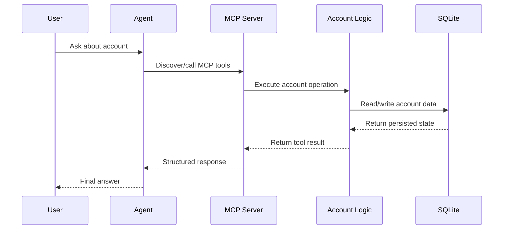
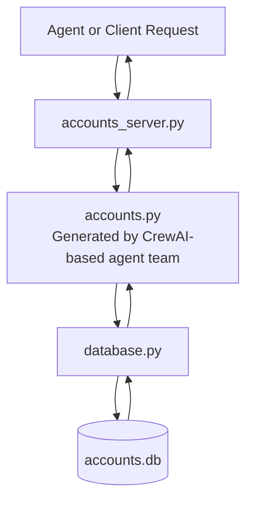

# Model Context Protocol (MCP): Architecture, Implementation, and Strategy

This repository demonstrates my hands-on understanding of the Model Context Protocol (MCP) and how it fits into modern agentic AI systems. It combines architecture, implementation, and trade-off analysis to show not only that I can use MCP effectively, but also that I can build and expose my own MCP server when a use case calls for it.

My goal with this project was not just to consume MCP servers, but to understand the protocol deeply enough to evaluate where it creates leverage, where it introduces unnecessary overhead, and how to implement it cleanly in a production-style workflow.

---

## Why MCP matters

The Model Context Protocol (MCP), introduced by Anthropic, is best understood as a standard interface layer for AI agents. It creates a consistent way for agents to discover and use external tools, prompt templates, and resources without requiring one-off integrations for every capability.

I think about MCP as the **USB-C for agentic AI**:

- Standardized connectivity between agents and tools
- Reusable interfaces across local and hosted services
- Easier portability of capabilities across ecosystems
- Better composability when agents need to orchestrate multiple tools

That said, MCP is not an agent framework. It is a protocol. That distinction matters because the best use case for MCP is usually **tool distribution and interoperability**, not the fastest possible implementation of an internal-only function.

---

## What this project shows

This project showcases three things:

1. **Practical MCP integration** inside an OpenAI Agents SDK workflow
2. **Custom MCP server development** using `FastMCP`
3. **Architectural judgment** about when MCP is the right abstraction and when it is not

The implementation wraps account-management business logic in a custom MCP server, exposes tools and resources over `stdio`, and demonstrates how those capabilities can be consumed by an agent or a lower-level client. A key part of the story is that the underlying `accounts.py` domain logic was originally produced by an agent engineering team I built using CrewAI, then adapted and operationalized as an MCP-accessible service.

---

## Architecture

At a high level, this project follows the standard MCP model:

- **Host**: the application that runs the agent
- **Client**: the connector that communicates with one MCP server
- **Server**: the process that exposes tools and resources

In this repository, the host is an agent workflow using the OpenAI Agents SDK, the MCP server is a Python process launched over `stdio`, and the client can either be managed by the SDK or created manually for lower-level control.

```mermaid
flowchart LR
    U[User Request] --> H[Host Application / Agent]
    H --> C[MCP Client]
    C -->|stdio| S[Custom MCP Server]
    S --> B[Account Business Logic\n(CrewAI-generated foundation)]
    B --> D[(SQLite Database)]
```

---

## Repository structure

```text
.
├── accounts.py            # Core account business logic
├── accounts_server.py     # Custom MCP server exposing tools/resources
├── accounts_client.py     # Manual MCP client for tool/resource access
├── database.py            # SQLite persistence layer
└── 2_lab2.ipynb           # Notebook showing agent + MCP usage
```

### File responsibilities

- `accounts.py` contains the domain logic for account operations like balances, holdings, trades, and strategy updates. That module was originally written by an agent engineering team I built with CrewAI, then retrofitted into this MCP implementation.
- `accounts_server.py` wraps that logic as MCP tools and resources.
- `accounts_client.py` shows how to connect to the server, list tools, call tools, and read resources.
- `database.py` persists accounts, logs, and market data in SQLite.
- `2_lab2.ipynb` demonstrates MCP usage from an OpenAI Agents SDK workflow.

---

## From CrewAI output to MCP service

One of the most important aspects of this project is that it was not built from a blank slate. The `accounts.py` module started as code written by my agent engineering team, which I built using CrewAI to generate and structure the business logic layer.

That matters because it shows two complementary skills:

- I can design and orchestrate agent teams that produce usable code
- I can take that generated output, harden it, persist it, and expose it through a clean protocol boundary

In other words, this project is not just about MCP fluency. It is also a practical example of turning agent-generated code into a more durable platform capability.

---

## Custom MCP server

The custom server is built with `FastMCP` and exposes both tools and resources. One of the aspects that makes this project especially meaningful is that I was not starting from hand-written business logic alone; I took an `accounts.py` module generated by my CrewAI-based agent engineering team and turned it into a shareable MCP service with persistence, tooling, and agent integration.

### What the server exposes

**Tools**
- `get_balance`
- `get_holdings`
- `buy_shares`
- `sell_shares`
- `change_strategy`

**Resources**
- `accounts://{name}` for a generated account report
- `accounts://strategy/{name}` for account strategy context

### Server snippet

```python
from mcp.server.fastmcp import FastMCP
from accounts import Account

mcp = FastMCP("accounts_server")

@mcp.tool()
async def get_balance(name: str) -> float:
    """Get the cash balance of the given account."""
    return Account.get(name).balance

@mcp.tool()
async def buy_shares(name: str, symbol: str, quantity: int, rationale: str) -> float:
    """Buy shares of a stock."""
    return Account.get(name).buy_shares(symbol, quantity, rationale)

@mcp.resource("accounts://{name}")
async def read_account_resource(name: str) -> str:
    account = Account.get(name.lower())
    return account.report

if __name__ == "__main__":
    mcp.run(transport="stdio")
```

### Why this matters

This implementation shows that I understand more than just how to call an MCP server. I can take business logic produced by an agentic workflow, define tool contracts around it, expose structured resources, wrap the logic behind the protocol, and run the server as an isolated process using the standard transport model.

---

## Agent integration

One of the strongest parts of MCP is how cleanly it plugs into agent frameworks when the SDK provides native support.

In the notebook workflow, the server is launched with `MCPServerStdio`, tools are discovered dynamically, and the agent can use them during execution.

### OpenAI Agents SDK integration snippet

```python
from agents import Agent, Runner, trace
from agents.mcp import MCPServerStdio

params = {
    "command": "uv",
    "args": ["run", "accounts_server.py"],
}

instructions = """
You are able to manage an account for a client,
and answer questions about the account.
"""

async with MCPServerStdio(params=params, client_session_timeout_seconds=30) as mcp_server:
    agent = Agent(
        name="account_manager",
        instructions=instructions,
        model="gpt-4.1-mini",
        mcp_servers=[mcp_server],
    )

    with trace("account_manager"):
        result = await Runner.run(
            agent,
            "My name is Ed and my account is under the name Ed. What's my balance and holdings?"
        )
```

### Integration flow



This pattern is powerful because the agent does not need hardcoded business logic in the application layer. It can discover capabilities through MCP and invoke them as needed.

---

## Manual MCP client

I also built a manual MCP client to understand the protocol beneath the SDK abstraction. That client is useful for lower-level control, especially when working with resources that are not fully abstracted by higher-level tooling.

### Client snippet

```python
import mcp
from mcp.client.stdio import stdio_client
from mcp import StdioServerParameters

params = StdioServerParameters(
    command="uv",
    args=["run", "accounts_server.py"],
    env=None,
)

async def list_accounts_tools():
    async with stdio_client(params) as streams:
        async with mcp.ClientSession(*streams) as session:
            await session.initialize()
            tools_result = await session.list_tools()
            return tools_result.tools

async def read_accounts_resource(name):
    async with stdio_client(params) as streams:
        async with mcp.ClientSession(*streams) as session:
            await session.initialize()
            result = await session.read_resource(f"accounts://{name}")
            return result.contents[0].text
```

### Why build the client manually

Writing the client made the protocol mechanics much clearer:

- How the MCP session is initialized
- How tool discovery works
- How a tool call differs from a resource read
- How MCP output can be translated into a shape consumable by an LLM runtime

That deeper understanding is important because real-world platform work often requires going below the convenience layer.

---

## Data and persistence layer

The project uses SQLite to persist account state, logs, and market data.

### Data flow



### Persistence responsibilities

- Store account state in an `accounts` table
- Record operational events in a `logs` table
- Store market snapshots in a `market` table

This design keeps the protocol layer thin while preserving domain logic and persistence as separate concerns. It also demonstrates a pattern I care about architecturally: agent-generated code can become durable platform capability when it is hardened, persisted, and exposed through a clean protocol boundary.

---

## MCP vs native function tools

One of the most important lessons from this project is that MCP is not always the right answer.

### Use MCP when

- You want to **share** a capability across teams or external users
- You need a standardized interface for tools, prompts, or resources
- You want a service to be discoverable within the growing MCP ecosystem
- You expect multiple hosts or agent runtimes to consume the same capability

### Use native function tools when

- The tool is internal-only
- Speed of implementation matters most
- There is no need for process separation or protocol overhead
- A simple `@function_tool` approach already solves the problem cleanly

### My architectural take

For internal-only workflows, MCP can be overkill. For distributed tool sharing, ecosystem interoperability, or clean protocol boundaries, MCP becomes much more compelling.

That trade-off is exactly why I built this project: to develop not just implementation skill, but judgment.

---

## Security considerations

Running an MCP server is effectively equivalent to running third-party code on your machine. That means the security model should be treated with the same seriousness as installing Python or Node packages.

My approach to MCP security is straightforward:

- Vet the publisher and repository
- Review the exposed tools and resources
- Inspect the code when possible
- Prefer trusted sources for production usage
- Use isolation where appropriate for higher-risk integrations

This is especially important as MCP marketplaces grow and non-technical users begin adding servers without understanding the execution model.

---

## Portfolio value

This project is a strong portfolio example because it shows capability at multiple layers:

- **Protocol understanding**: I understand MCP architecture, transports, and the role of hosts, clients, and servers.
- **Implementation skill**: I can build a custom MCP server with tools and resources.
- **Agent engineering depth**: I can take code generated by a CrewAI-based agent engineering team I designed and evolve it into a usable, protocol-driven service.
- **Agent integration**: I can wire MCP into an OpenAI Agents SDK workflow.
- **Systems thinking**: I understand when MCP is the right abstraction and when it is too heavy.
- **Platform mindset**: I treat interoperability, separation of concerns, and security as first-class design decisions.

If you are evaluating this repo from a hiring perspective, the main takeaway is simple: I do not just know how to talk about MCP. I can implement it, integrate it, and make pragmatic architectural decisions around it.

---

## Next extensions

A few logical next steps for this project would be:

- Add a hosted/SSE version of the server
- Expose richer MCP resources for account summaries and audit history
- Add authentication and policy controls around sensitive tools
- Publish the server in an MCP marketplace-ready format
- Extend the example into a broader agentic finance operations workflow

---

## Closing note

I built this project to move beyond theory and understand MCP end to end: protocol, transport, tooling, resources, orchestration, persistence, and trade-offs. That foundation gives me confidence not only in using existing MCP servers, but in designing and building my own when the product or platform strategy calls for it.
